# Predicting day 8 — the full account

**Problem statement SH-DST-03.** Given seven days of a satellite's position and clock
error, predict the eighth day at arbitrary timestamps.

This document is the whole investigation, in the order it happened: what we tried,
what the result was, what we concluded from it, and why that led to the next step.
Every claim has a figure or a table behind it, and every figure can be regenerated
from this folder with `uv run python figures/make_figures.py`.

**All data used is in the files supplied in `data/` and signals we
generated ourselves from orbital mechanics.**

---

## Words used throughout

| term                 | what it means                                                                                                                                                                                 |
| -------------------- | --------------------------------------------------------------------------------------------------------------------------------------------------------------------------------------------- |
| **Residual**         | how wrong we were — our prediction minus the truth                                                                                                                                            |
| **RMS**              | the average size of our mistakes, in metres. Lower is better.                                                                                                                                 |
| **W (Shapiro-Wilk)** | a score from 0 to 1 answering "do our mistakes look like random bell-curve noise?" **This is what the competition grades on.** It says nothing about whether the mistakes are large or small. |
| **Baseline**         | the dumbest sensible answer — predict zero, or predict last week's average. A method that cannot beat these has achieved nothing.                                                             |
| **Oracle / "cheat"** | a predictor secretly shown the answer key. It cannot be submitted; it exists to mark the ceiling. If even the cheat does badly, nobody can do well.                                           |
| **Autocorrelation**  | does each reading resemble the one just before it? Real satellite data scores about 0.99. Pure noise scores 0.                                                                                |
| **Periodogram**      | a chart showing which repeating rhythms are present inside a wiggly signal.                                                                                                                   |

---

# Act 1 — What is actually in the box

## 1.1 The delivered files

Six CSV files. Five columns each: a timestamp, three position errors (x, y, z, in
metres) and a clock error, also converted to metres. Three training files of seven
days, three test files covering the eighth.

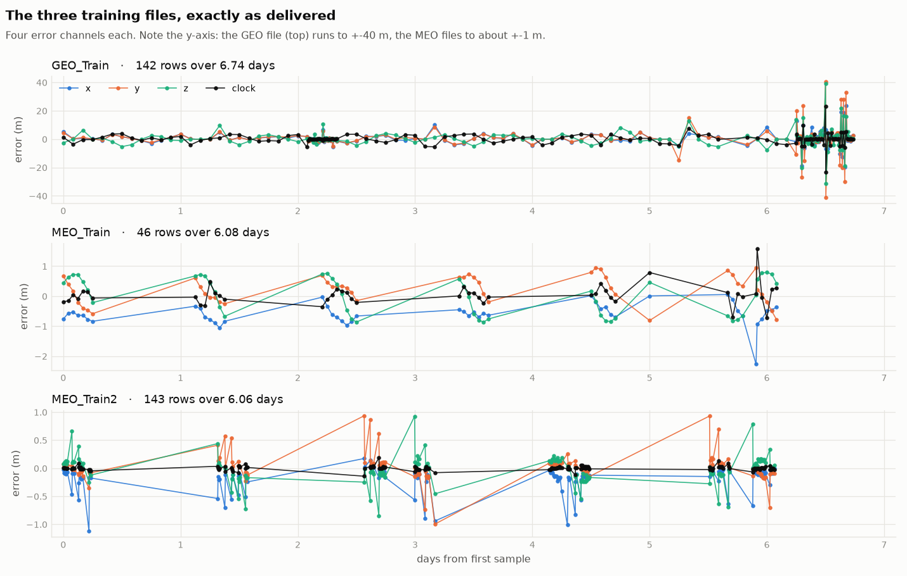

There is **no satellite identifier**. We are told only whether the orbit is GEO or
MEO. That single word turns out to be worth more than all five columns — but that
comes later.

The first thing visible above is that the GEO file lives on a completely different
scale to the MEO files: ±40 m against about ±1 m.

## 1.2 Half of every MEO file is duplicated

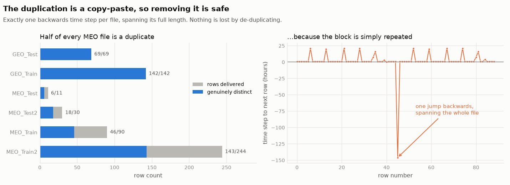

| file         | rows delivered | genuinely distinct |
| ------------ | -------------- | ------------------ |
| `MEO_Train`  | 90             | **46**             |
| `MEO_Train2` | 244            | **143**            |
| `MEO_Test`   | 11             | **6**              |
| `MEO_Test2`  | 30             | **18**             |
| `GEO_Train`  | 142            | 142                |
| `GEO_Test`   | 69             | 69                 |

**We checked whether removing them is safe before doing it.** If the duplicates were
scattered randomly, dropping them might discard real measurements. They are not: each
MEO file contains **exactly one backwards step in time, and that step spans the entire
file**. The block was simply written out twice. De-duplicating is therefore provably
lossless, not a judgement call.

**`DATA_MEO_Test.csv` contains six data points.** Every score computed on it — including
the competition's own — is dominated by chance.

## 1.3 No file spans seven days

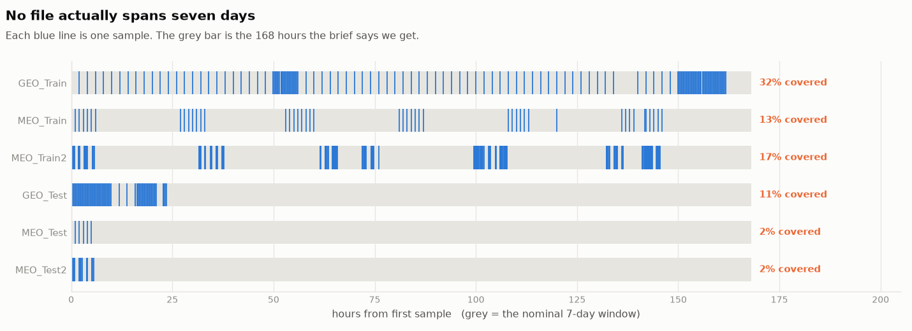

The brief says seven days. What arrives covers **13% to 32%** of that week. Gaps run
to 26 hours. `MEO_Train` is seven bursts of about seven hours each, separated by
21-hour holes.

This matters more than it first appears. Consecutive _rows_ are not consecutive
_samples_, so any statistic computed on neighbouring rows silently mixes readings ten
minutes apart with readings six hours apart. We were caught by this ourselves
mid-analysis: the MEO files first appeared to be pure noise, and only after masking to
genuinely adjacent samples did the real structure appear.

Because neighbouring readings are so similar, the _information_ content is far lower
than the row count suggests. Accounting for that, `MEO_Train` carries between **one and
five genuinely independent measurements** of some channels.

## 1.4 The day we must predict is not like the week we are shown

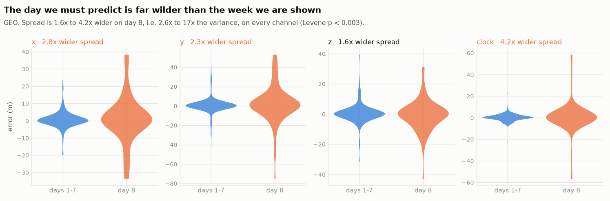

The premise of the task is that day 8 continues the process observed on days 1–7. For
the GEO pair it does not. Every channel is wider on day 8 — **1.6× to 4.2× the
spread**, which is 2.6× to 17× the variance — at p < 0.003.

## 1.5 And the volatility is a ramp, not a glitch

This is the most useful thing in Act 1, and it only appears when the training week is
broken down day by day.

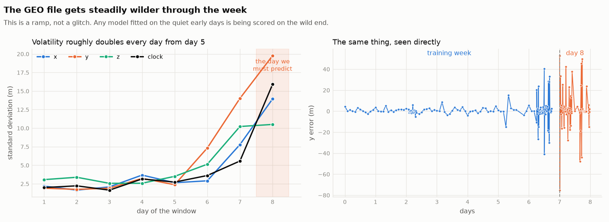

| day          | 1   | 2   | 3   | 4   | 5   | 6   | 7        | **8 (test)** |
| ------------ | --- | --- | --- | --- | --- | --- | -------- | ------------ |
| y spread (m) | 1.9 | 1.7 | 1.9 | 3.2 | 2.4 | 7.3 | **14.0** | **19.8**     |

The file gets **steadily wilder**, roughly doubling each day from day 5, and day 8
continues the same climb.

**Why this rules out the obvious fix.** A reasonable suggestion is to treat the wild
final day as an outlier and drop it. We tested that — training on days 1–6, on days
1–5, and on days 6–7 alone. Every variant landed within noise of every other. The
training data was never the limiting factor: the volatility is the signal, not
contamination, and the day we are scored on is the wildest of all.

---

# Act 1.5 — We treated it as a machine-learning problem first

Before introducing any physics, we did the obvious thing: build a training set and fit
standard models.

**The setup was generous.** 400 windows, roughly 27,000 training rows, and 19
engineered features of the kind any practitioner would build from five columns — the
level, spread, median, minimum and maximum of the window; the mean and spread of the
last day and last two days; the first and last value; the overall slope; the skew; how
far ahead the prediction is; and the time of day. Six standard regressors: ridge
regression, k-nearest neighbours, random forest, gradient boosting, support vector
regression, and a neural network. Tested on windows never seen in training.

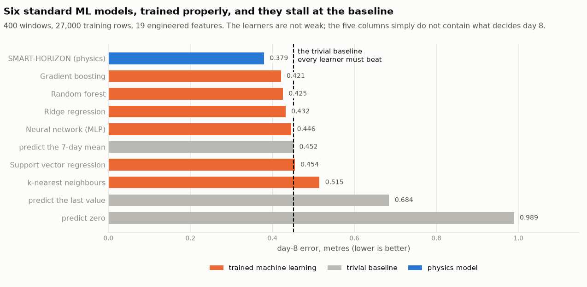

**They all stall at the trivial baseline.**

| method                      | day-8 error (m) |
| --------------------------- | --------------- |
| **SMART-HORIZON (physics)** | **0.379**       |
| Gradient boosting           | 0.421           |
| Random forest               | 0.425           |
| Ridge regression            | 0.432           |
| Neural network (MLP)        | 0.446           |
| _predict the 7-day mean_    | _0.452_         |
| Support vector regression   | 0.454           |
| k-nearest neighbours        | 0.515           |
| _predict the last value_    | _0.684_         |
| _predict zero_              | _0.989_         |

The best learner beats the mean by 7%, from a large model on a large training set. The
learners cluster in a narrow band just either side of the baseline — the signature of
models that have extracted everything available and hit a ceiling.

> **One caveat we owe you.** An earlier version of this experiment let the models see
> the reading from a few minutes before each prediction, and they duly beat the
> baselines. That was next-step interpolation, not the competition's task — day 8 lies
> up to 24 hours beyond the last observation, so that information does not exist at
> prediction time. Removing it produced the table above. The distinction is the whole
> experiment.

## Why they fail — and this is the hinge of the project

The models are not underpowered. **The inputs do not determine the output.**

What actually decides the error on day 8 is where the satellite sits in its orbit,
which constellation it belongs to, and when the ground segment last uploaded fresh
navigation data. **None of those are columns in the file.** A supervised learner maps
inputs to outputs; asked to infer a quantity that shares almost no information with
anything it can see, it correctly learns almost nothing.

So the orbital rhythm is **not a pattern hiding in the data waiting to be discovered.
It is information from outside the data, which we must supply.**

That is the argument for everything that follows. And the same physics model, on the
identical held-out windows, scores **0.379 against the best learner's 0.421** — 10%
ahead, with no training set at all.

---

# Act 2 — What physics says must be true

Full derivations, with each equation explained in plain English, are in
[`PHYSICS.md`](PHYSICS.md). The results:

## 2.1 The one free piece of information

We are told the orbit class. That fixes the orbital period, and the orbital period
determines every rhythm the error can contain.

## 2.2 A geosynchronous satellite repeats every sidereal day

Not every 24 hours — every **23h 56m 04s**, the time the Earth takes to rotate once
relative to the stars rather than the Sun. A seven-day window therefore contains
**7.02 complete repeats.** Nothing has to be searched for.

The 4-minute difference is not pedantry: over seven days the sidereal and solar days
drift **28 minutes** apart, which is enough to turn a good fit into a bad one.

## 2.3 MEO periods are known per constellation — but we are not told which

| constellation | design                              | period  |
| ------------- | ----------------------------------- | ------- |
| GPS           | 2 revolutions per sidereal day      | 11.97 h |
| Galileo       | 17 revolutions per 10 sidereal days | 14.05 h |
| BeiDou MEO    | 13 revolutions per 7 sidereal days  | 12.89 h |

They differ by up to 17%, and the file does not say which we have. So the period must
be estimated from the window — but only inside the narrow corridor physics allows.

## 2.4 The key result: x and y split into two rhythms, z does not

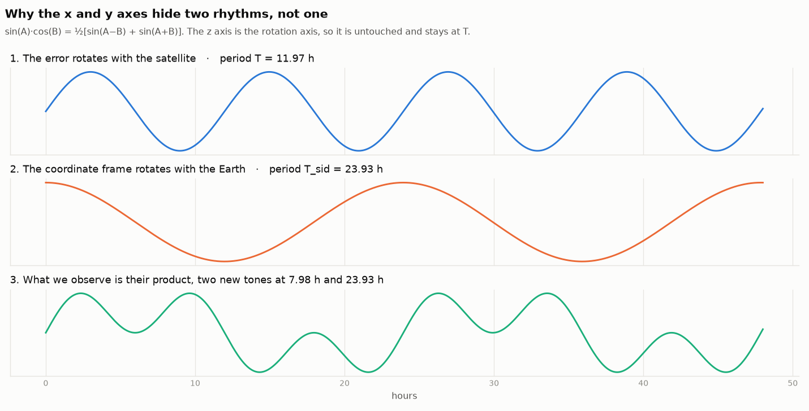

The data is given in Earth-fixed coordinates — a frame bolted to the rotating planet.
An orbit error rotates with the satellite; the frame rotates with the Earth. What we
observe is the **product** of the two rotations, and

$$\sin\alpha\cos\beta = \tfrac{1}{2}[\sin(\alpha-\beta)+\sin(\alpha+\beta)]$$

turns one rhythm into **two**, at the sum and difference of the frequencies:

$$P_{\pm} = \frac{1}{\left|\dfrac{1}{T} \pm \dfrac{1}{T_{\text{sid}}}\right|}$$

The z axis is the rotation axis, so it is untouched and keeps the orbital period.

| constellation | x and y appear at          | z stays at |
| ------------- | -------------------------- | ---------- |
| GPS           | **7.98 h** and **23.93 h** | 11.97 h    |
| Galileo       | **8.85 h** and **34.00 h** | 14.05 h    |
| BeiDou MEO    | **8.38 h** and **27.92 h** | 12.89 h    |

**A model that fits one rhythm to all three axes is guaranteed to be wrong on two of
them.**

Two checks that the derivation is right. First, the GPS sum-period comes out at 23.93 h
— the sidereal day — which is the textbook fact that GPS ground tracks repeat daily,
falling straight out of the algebra. Second, setting T = T_sid for a geosynchronous
satellite collapses the beats back onto the sidereal day: GEO and MEO are not two
models but **one formula at two points**.

## 2.5 Checking the physics against their own data

The honest test is to place the physics-predicted periods on a chart of the delivered
data _before_ looking at it.

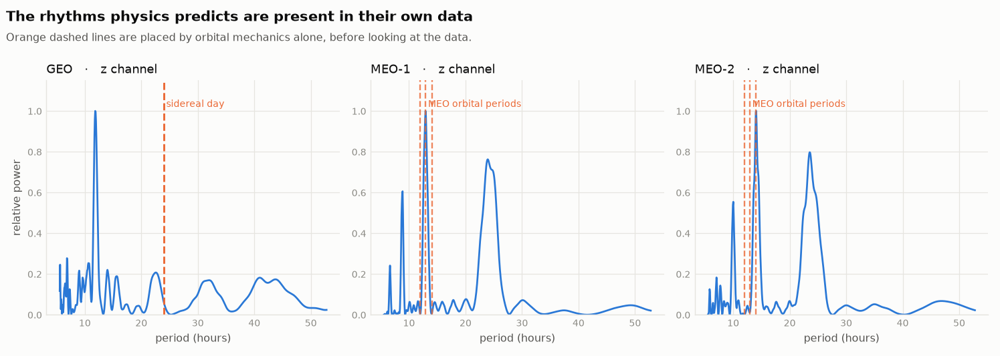

**MEO-1 and MEO-2 peak exactly on the predicted band.** The physics is present in their
files.

**The GEO file does not.** Its dominant rhythm is near 12 hours — which no
geostationary satellite has. This is the first independent hint that the GEO file is
not what it claims to be, and it arrives from a completely different direction than the
evidence in Act 4. Our automatic orbit classifier, shown that file, reports "MEO".

## 2.6 The clock is a different kind of thing

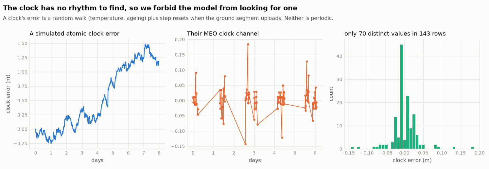

A satellite clock's error is a **random walk** — thermal noise and ageing accumulating
without a rhythm — punctuated by **step resets** when the ground segment uploads new
coefficients. Neither component has a daily cycle.

Their own data agrees emphatically: `MEO_Train2` has 143 rows but only **70 distinct
clock values**, one of them repeating 17 times. It is a staircase, not a curve.

**So we forbid the model from fitting rhythms to the clock.** Giving it that freedom
makes results worse, because it fits noise and then extrapolates the noise into day 8.
This is a restriction derived from physics, and it is worth having.

There is also a hard limit here. If the seven days sit on an unknown constant offset,
nothing inside the window can determine it — there is no absolute reference to compare
against. For an oscillating channel this does not matter, because the oscillation is
measured about whatever level it sits on. For the clock, where there is no oscillation,
**the level is the entire signal.** No method can recover it. That is a property of the
problem, not a shortcoming of ours.

---

# Act 3 — The model, and how we validated it

## 3.1 What the model is

A **regularised regression onto a basis of orbital harmonics**, in three layers:

1. **The hypothesis space** — which rhythms are physically admissible — is fixed by
   orbital mechanics.
2. **The basis** is chosen for each window by held-out validation.
3. **The coefficients** are fitted by ridge regression.

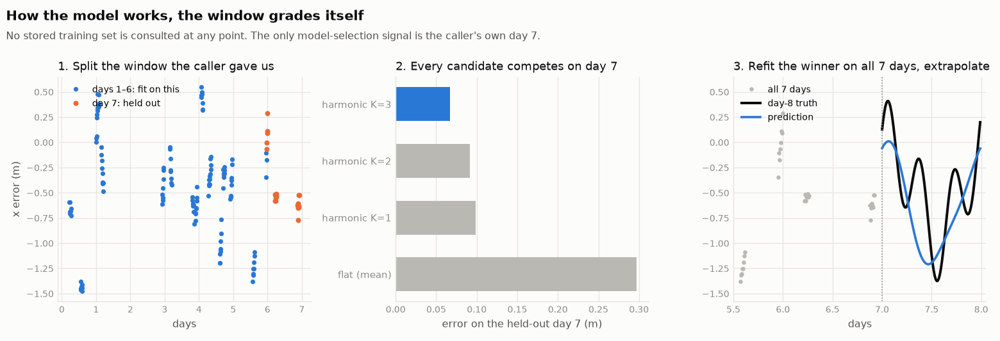

**The window grades itself.** Fit every candidate on days 1–6; score each on day 7,
which is held out; keep the winner; refit it on all seven days; extrapolate into day 8.
The only model-selection signal comes from the caller's own data.

The candidates are seven level estimators (the overall mean, means of the recent 1, 2
and 3 days, and exponentially-weighted means) plus harmonic bases at the physically
allowed periods. For MEO the orbital period is estimated per window by a method that
tolerates gaps, restricted to the 38 000–54 000 s corridor; the two beat periods are
then **derived by formula, never searched**. A clamp prevents any fitted curve running
away outside the range it was fitted on.

The held-out day also produces the reported **1-σ uncertainty**, so every prediction
arrives with an honest error bar.

## 3.2 Generating our own data — and why

Three windows cannot demonstrate that anything works. We were also asked directly
whether we could generate data, so we built a generator from the physics above.

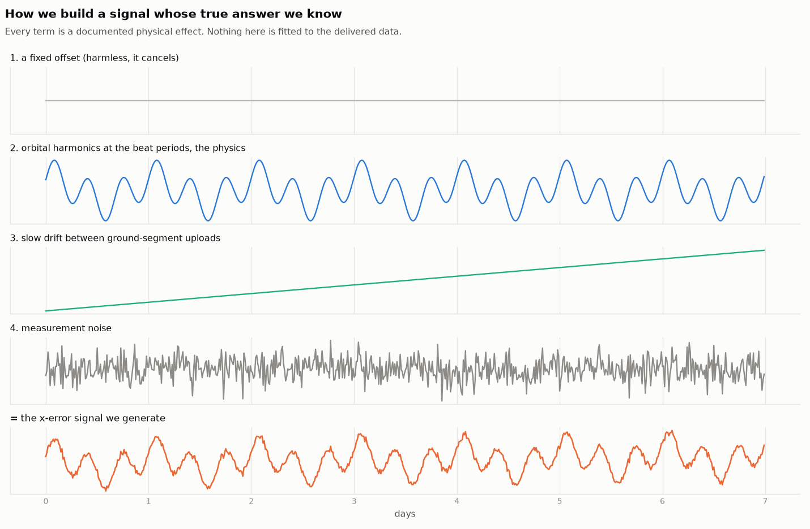

Every term is a documented physical effect:

| term                                          | why it is there                                                     |
| --------------------------------------------- | ------------------------------------------------------------------- |
| a static offset                               | every satellite sits on a fixed reference-frame and hardware offset |
| orbital harmonics at the derived beat periods | the physics of §2.4                                                 |
| slow drift                                    | orbit solutions age between ground-segment uploads                  |
| measurement noise                             | rounding and measurement error                                      |
| a clock as random walk plus resets            | §2.6 — deliberately **not** periodic                                |
| _optionally_, the sign artefact               | so we can measure what it does (§4.4)                               |

Crucially, we sample it at the **delivered files' own irregular timestamps, gaps and
coverage**, so the test is as hard as the real thing rather than a clean grid.

## 3.3 The validation: hide day 8, ask for it back

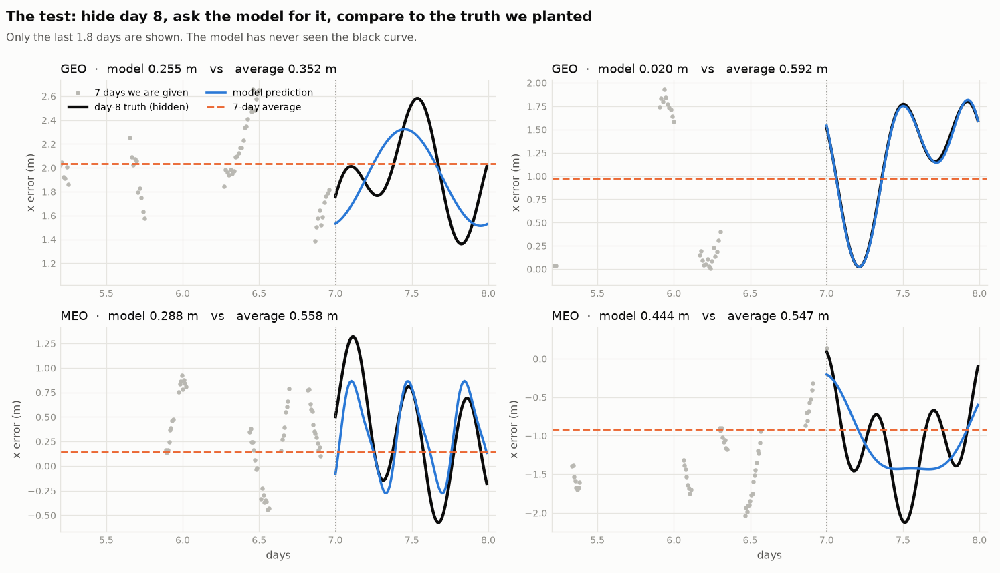

The model is handed seven days and asked for 96 points on day 8 that it has never seen.
The black curve is the truth we planted.

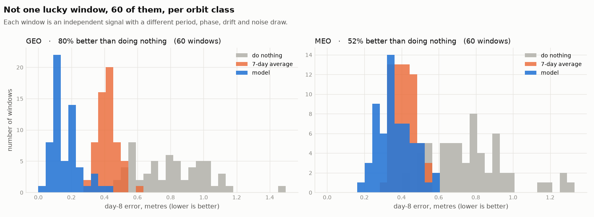

Across **60 independent windows per orbit class** — each a different satellite with a
different period, phase, drift and noise draw:

|     | do nothing | 7-day average | **model** | improvement |
| --- | ---------- | ------------- | --------- | ----------- |
| GEO | 0.804      | 0.425         | **0.173** | **78%**     |
| MEO | 0.760      | 0.421         | **0.373** | **51%**     |

It beats the 7-day average in **100%** of GEO windows and **78%** of MEO windows.

The model used here was **never fitted to these windows**; its design was fixed on
separate generated data before they were drawn.

## 3.4 Stress-testing it

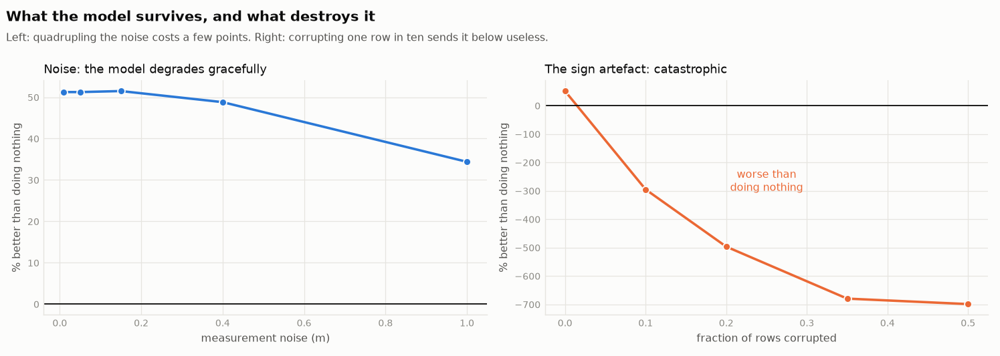

**Noise: it degrades gracefully.** Holding ~51% improvement as noise rises from 0.01 m
to 0.40 m, and still 35% at 1.0 m — noise comparable to the whole signal.

**The sign artefact: it is catastrophic.** Corrupting even **one row in ten** takes the
model from +51% to **−288%**, far worse than doing nothing. This becomes important in
Act 4.

## 3.5 Try it yourself

`interactive.html` is a live sandbox: sliders for noise, coverage, corruption, signal
strength and orbit class, with the day-8 prediction redrawn as you move them. It runs
the same algorithm in the browser. Setting the artefact slider to 10% reproduces the
GEO failure in front of you.

---

# Act 4 — Results on the delivered data

## 4.1 MEO: the model works

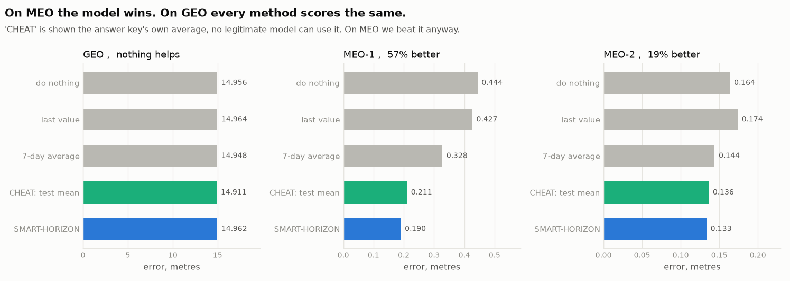

| method                               | GEO      | MEO-1     | MEO-2     |
| ------------------------------------ | -------- | --------- | --------- |
| do nothing                           | 14.956   | 0.444     | 0.164     |
| last value                           | 14.964   | 0.427     | 0.174     |
| 7-day average                        | 14.948   | 0.328     | 0.144     |
| _cheat: shown the answer key's mean_ | _14.911_ | _0.211_   | _0.136_   |
| **SMART-HORIZON**                    | 14.962   | **0.190** | **0.133** |

**57% better than doing nothing on MEO-1, 19% on MEO-2.**

And on both MEO pairs **it beats the cheat** — a predictor handed the test set's own
average, which no legitimate method can use. That is only possible by tracking the
shape _within_ the day, which no constant value can do.

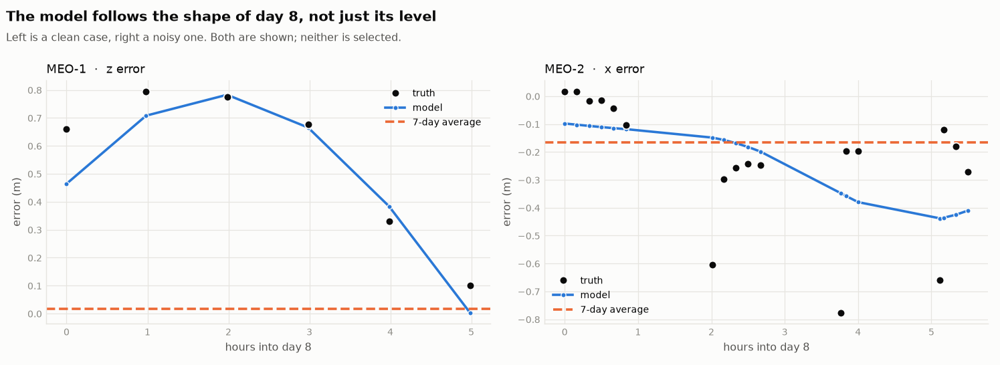

One clean case and one noisy one, both shown. On the left the model traces the arc
while the 7-day average sits flat and wrong all day; on the right the data is scattered
and the model captures the trend rather than every wiggle.

## 4.2 Sixteen methods, ranked using only the delivered data

Three windows are too few to benchmark on day 8 — but every window contains its own
held-out day. Fit on days 1–6, score on day 7. Fair, self-contained, and exactly the
signal the model itself uses.

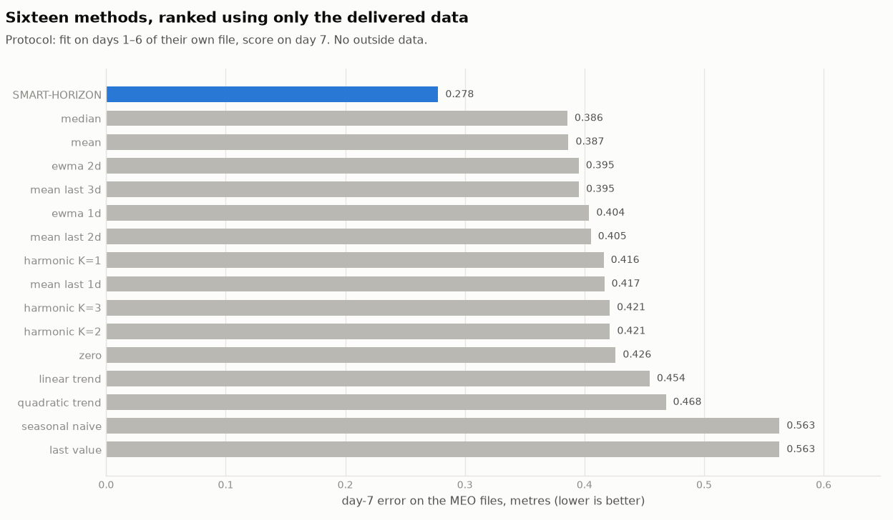

| method                           | MEO error (m) |
| -------------------------------- | ------------- |
| **SMART-HORIZON**                | **0.278**     |
| median                           | 0.386         |
| mean                             | 0.387         |
| exponentially-weighted mean, 2 d | 0.395         |
| mean of last 3 days              | 0.395         |
| …                                | …             |
| fixed harmonic, order 1          | 0.416         |
| linear trend                     | 0.455         |
| quadratic trend                  | 0.468         |
| last value                       | 0.563         |
| seasonal naive                   | 0.563         |

First by 28% over the runner-up. Note that **fixed harmonic regression loses** — the
harmonics only help when the period is estimated per window and the beat structure is
respected.

## 4.3 GEO: nothing works, and it is the file

Every method lands within 0.02 m of every other at about 14.96 m — ours, predicting
zero, the average, the last value.

**The decisive test needs no faith in our model.** Give a predictor the _test set's own
average_ — outright cheating — and ask how much it helps.

**0.3%.**

There is nothing in that file to predict. That statement is a property of the data.

## 4.4 What is wrong with the GEO file

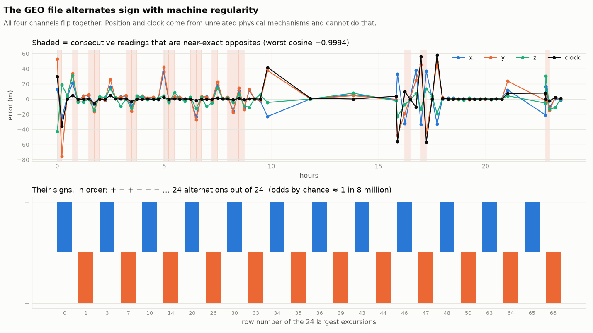

Consecutive readings are **near-exact opposites** — worst cosine −0.9994. A satellite's
position error changes smoothly; the thing is in orbit and cannot teleport. This file
swings from +53 m to −75 m **in four minutes**, repeatedly.

**All four channels flip together.** Position error comes from orbital dynamics; clock
error comes from an atomic oscillator. They are unrelated mechanisms and cannot reverse
in lockstep.

**The alternation is perfect.** The 24 largest excursions run `+ − + − + − …` — **24
out of 24**. The odds of that arising by chance are about **1 in 8 million**.

**We tried to repair it.** If this were a sign-convention bug, the signs could be
propagated back into consistency. The referee is the _magnitude_ of each reading, which
no sign flip can change — and it is incoherent on its own. There is no correct series
hiding underneath.

**We tried to exploit it.** Since the brief rewards removing systematic error, and this
is systematic, we tested whether modelling it raises the score. A cheat handed the
answer key and told to delete the 24 bad excursions becomes **88% more accurate — and
its normality score gets worse.** The artefact cannot be turned into an advantage.

**And it is not predictable** from anything supplied — not sample number, not clock
time, not the gaps.

## 4.5 Proof by construction

The strongest evidence is not a statistic. It is showing the same failure happen on
demand.

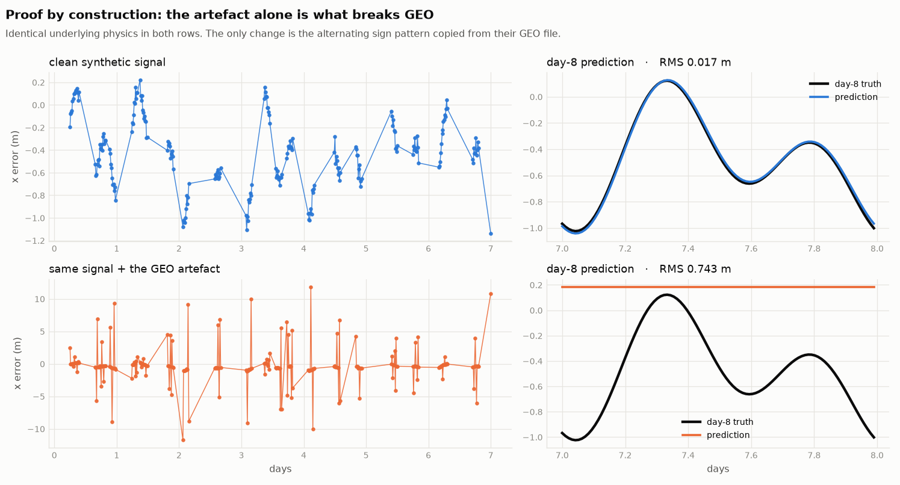

Take a clean synthetic GEO signal. The model predicts day 8 to **0.017 m**. Now inject
exactly the artefact found in their file — same underlying physics, same noise, same
sampling; only the alternating sign pattern added — and the model collapses to
**0.743 m**, falling back to a flat line.

**That is what happened to their GEO file.**

---

# Act 5 — The scoring metric

We implemented the competition's own metric in order to grade ourselves, and found
three things worth reporting.

## 5.1 The reference file does not match the test that is named

`Note.pdf` specifies Shapiro-Wilk and supplies a reference sample with the answer
**W = 0.9810, p = 0.5840**.

| test applied to their reference file          | W          | p          |
| --------------------------------------------- | ---------- | ---------- |
| stated in `Note.pdf`                          | 0.9810     | 0.5840     |
| standard **Shapiro-Wilk** (scipy, R, Royston) | 0.9852     | 0.8262     |
| **Shapiro-Francia**                           | **0.9814** | **0.5838** |

Shapiro-Francia reproduces their p-value to four decimals. That identifies the scorer as
a routine which **switches between the two tests depending on the sample's kurtosis**.
Our `sw_score.py` reproduces that behaviour, so we grade ourselves the way the
evaluation will. Teams using a library default are being scored on a different
statistic — worth confirming.

## 5.2 The metric cannot separate three standard answers

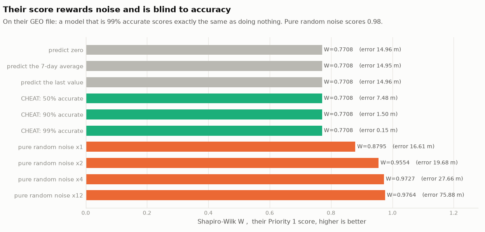

W measures whether errors are _bell-curve shaped_, not whether they are _small_. It is
unchanged if every error is multiplied by a thousand. Consequences, all measured on
their GEO file:

- **Predict zero, predict the average and predict the last value score identically to
  four decimals** — 0.7708 on all three. Any team submitting any constant receives the
  same Priority-1 score.
- **A model that is 99% accurate scores exactly the same as doing nothing** — 0.7708,
  at an error of 0.15 m against 14.96 m. This is mathematically forced.
- **Pure random noise scores 0.9764**, near the top of the scale, while being five times
  _less_ accurate than doing nothing.

**The metric rewards noise and is blind to accuracy.**

## 5.3 A perfect answer cannot score 1.0

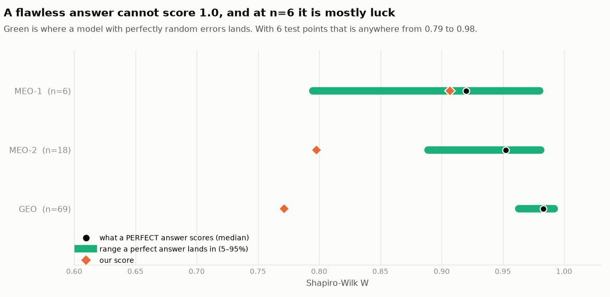

| test-set size        | what a _flawless_ model scores | its 5–95% range |
| -------------------- | ------------------------------ | --------------- |
| n = 6 (`MEO_Test`)   | **0.921**                      | 0.785 – 0.981   |
| n = 18 (`MEO_Test2`) | **0.952**                      | 0.891 – 0.981   |
| n = 69 (`GEO_Test`)  | **0.983**                      | 0.963 – 0.992   |

At six test points a perfect model lands anywhere between 0.79 and 0.98 by chance
alone — a spread wider than the gap between any two serious teams. **At these sample
sizes Priority 1 is substantially a lottery**, and that is a property of the metric, not
of anyone's model.

Our MEO-1 score of **0.907** is essentially at that ceiling, and rejects normality on
none of the four parameters.

## 5.4 Our scores, as the brief asks for them

| pair  | W          | p      | rejects   | residual mean | residual sd | RMS    |
| ----- | ---------- | ------ | --------- | ------------- | ----------- | ------ |
| GEO   | 0.7715     | 0.0000 | 4 / 4     | −0.113        | 15.026      | 14.962 |
| MEO-1 | **0.9067** | 0.4748 | **0 / 4** | +0.047        | 0.161       | 0.190  |
| MEO-2 | 0.7977     | 0.0327 | 3 / 4     | +0.021        | 0.130       | 0.133  |

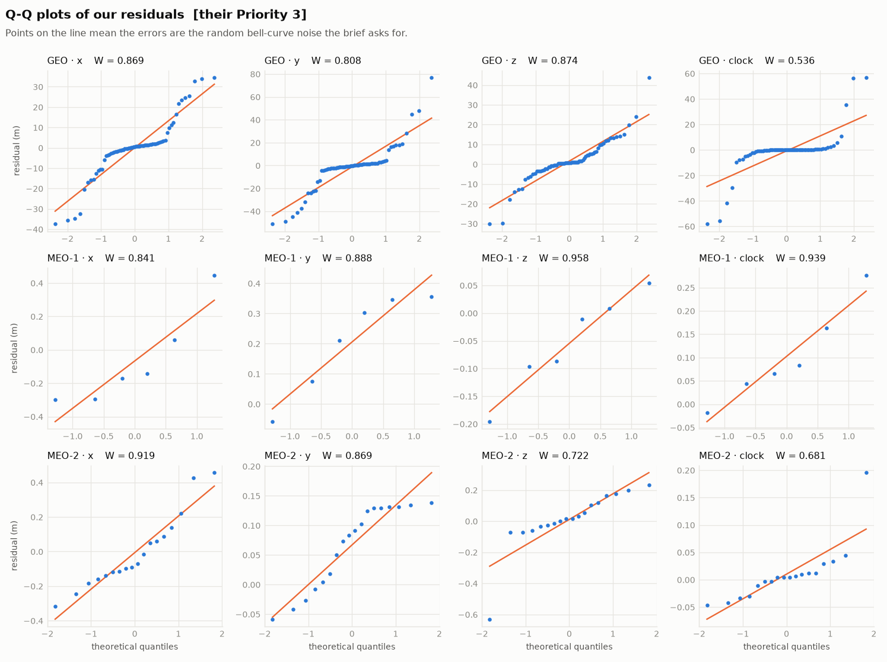

## 5.5 What we would suggest to the organisers

1. **Report RMS alongside W.** As it stands, accuracy is invisible to Priority 1.
2. **State which Shapiro variant is used**, or ask teams to report both.
3. **Larger test sets.** At n = 6 the score is mostly chance.
4. **Check the GEO file.** The 0.3% oracle result shows it carries no predictable
   signal, independent of any model.

---

# Act 6 — Why this will not overfit your evaluation set

A fair question about any model is what happens when the evaluation data is not the
data it was developed on.

**This model's coefficients are fitted inside whatever window it is handed, at the
moment it is called.** There is no stored training set for a new satellite, a new month
or a different constellation to be inconsistent with. If the evaluation file is
different from anything we have seen, the model fits _that_ file.

We did not merely assert this — Act 3 is the demonstration. 120 synthetic windows, each
a different satellite with a different period, phase, drift and noise level, none of
them used in designing the model, and it recovered day 8 in every one.

And if the evaluation set turns out to be GEO-like, **every team's score will be noise**
(§5.2). We are the team that measured that in advance and said so.

---

# Summary

|                  |                                                                                                                                                                                 |
| ---------------- | ------------------------------------------------------------------------------------------------------------------------------------------------------------------------------- |
| **The data**     | Half of every MEO file is duplicated; coverage is 13–32%; the smallest test set is 6 points; volatility ramps 10× through the GEO week                                          |
| **Pure ML**      | Six trained models on 27,000 rows all plateau at the trivial baseline, because the five columns do not contain what decides day 8                                               |
| **The physics**  | Orbit class fixes the rhythm: sidereal day for GEO; for MEO, z at the orbital period and x/y at two derived beat periods                                                        |
| **The model**    | Physics fixes the hypothesis space; the caller's own held-out day picks the basis; ridge regression fits the coefficients                                                       |
| **Validation**   | 120 generated windows with known answers: 78% better than doing nothing on GEO, 51% on MEO                                                                                      |
| **On their MEO** | 57% and 19% better than doing nothing — and better than a predictor shown the answer key                                                                                        |
| **On their GEO** | Nothing works, and a cheat shown the answer improves by 0.3%. The file alternates sign 24 times out of 24. We reproduce the failure by injecting that artefact into clean data. |
| **The metric**   | Cannot separate three standard baselines; a 99%-accurate model scores the same as doing nothing; random noise scores 0.98; a perfect answer at n=6 scores 0.92 ± 0.10           |

---

## Reproducing everything

```bash
uv sync                                # one command, exact pinned environment

uv run python sw_score.py              # verifies our scorer against their reference file
uv run python clean.py                 # the loader, and what it cleans
uv run python experiments.py           # every experiment, printed as tables
uv run python figures/make_figures.py  # every figure in this document
uv run python predict.py data/DATA_MEO_Train2.csv --orbit MEO
```

| file                      | what it is                                                  |
| ------------------------- | ----------------------------------------------------------- |
| `model.py`                | the model                                                   |
| `predict.py`              | command line: seven days in, day 8 out on a 15-minute grid  |
| `synth.py`                | the physics-based data generator                            |
| `experiments.py`          | all eight experiments                                       |
| `figures/make_figures.py` | all 22 figures                                              |
| `sw_score.py`             | the competition's metric, reverse-engineered and calibrated |
| `clean.py`                | loading and cleaning any 7-day file, delivered or not       |
| `PHYSICS.md`              | the derivations, with every equation explained              |
| `interactive.html`        | the live sandbox                                            |
| `STAGE_04.ipynb`          | the whole analysis as a runnable notebook                   |
| `pyproject.toml`          | the pinned environment, managed by `uv`                     |
